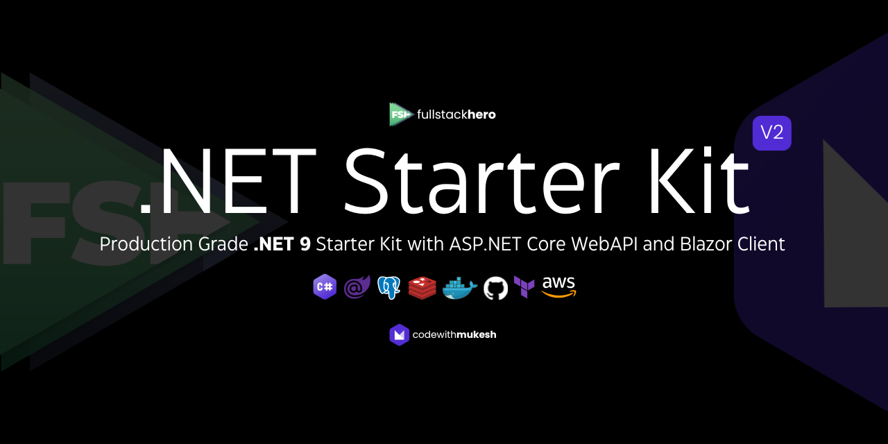

# FullStackHero .NET 8 Starter Kit 🚀

> With ASP.NET Core Web API & Blazor Client

FullStackHero .NET Starter Kit is a starting point for your next `.NET 8 Clean Architecture` Solution that incorporates the most essential packages and features your projects will ever need including out-of-the-box Multi-Tenancy support. This project can save well over 200+ hours of development time for your team.



# Important

This project is currently work in progress. The NuGet package is not yet available for v2. For now, you can fork this repository to try it out. [Follow @iammukeshm on X](https://x.com/iammukeshm) for project related updates.

# Quick Start Guide

As the project is still in beta, the NuGet packages are not yet available. You can try out the project by pulling the code directly from this repository.

Prerequisites:

- .NET 8 SDK installed.
- Visual Studio IDE.
- Docker Desktop.
- PostgreSQL instance running on your machine or docker container.

Please follow the below instructions.

1. Fork this repository to your local.
2. Open up the `./src/FSH.Starter.sln`.
3. This would up the FSH Starter solution which has 3 main components.
   1. Aspire Dashboard (set as the default project)
   2. Web API
   3. Blazor
4. Now we will have to set the connection string for the API. Navigate to `./src/api/server/appsettings.Development.json` and change the `ConnectionString` under `DatabaseOptions`. Save it.
5. Once that is done, run the application via Visual Studio, with Aspire as the default project. This will open up Aspire Dashboard at `https://localhost:7200/`.
6. API will be running at `https://localhost:7000/swagger/index.html`.
7. Blazor will be running at `https://localhost:7100/`.

# 🔎 The Project

# ✨ Technologies

- ASP.NET Core 8
- Entity Framework Core 8
- Blazor
- MediatR
- PostgreSQL
- Redis
- FluentValidation

# 👨‍🚀 Architecture

# 📬 Service Endpoints

| Endpoint | Method | Description      |
| -------- | ------ | ---------------- |
| `/token` | POST   | Generates Token. |

# 🧪 Running Locally

# 🐳 Docker Support

# ☁️ Deploying to AWS

# 🤝 Contributing

# 🍕 Community

Thanks to the community who contribute to this repository! [Submit your PR and join the elite list!](CONTRIBUTING.md)

[](https://github.com/fullstackhero/dotnet-starter-kit/graphs/contributors)

# 📝 Notes

## Add Migrations

Navigate to `./api/server` and run the following EF CLI commands.

```bash
dotnet ef migrations add "Add Identity Schema" --project .././migrations/postgresql/ --context IdentityDbContext -o Identity
dotnet ef migrations add "Add Tenant Schema" --project .././migrations/postgresql/ --context TenantDbContext -o Tenant
dotnet ef migrations add "Add Todo Schema" --project .././migrations/postgresql/ --context TodoDbContext -o Todo
dotnet ef migrations add "Add Catalog Schema" --project .././migrations/postgresql/ --context CatalogDbContext -o Catalog
```

## What's Pending?

- Few Identity Endpoints
- Blazor Client
- File Storage Service
- NuGet Generation Pipeline
- Source Code Generation
- Searching / Sorting

# ⚖️ LICENSE

MIT © [fullstackhero](LICENSE)
