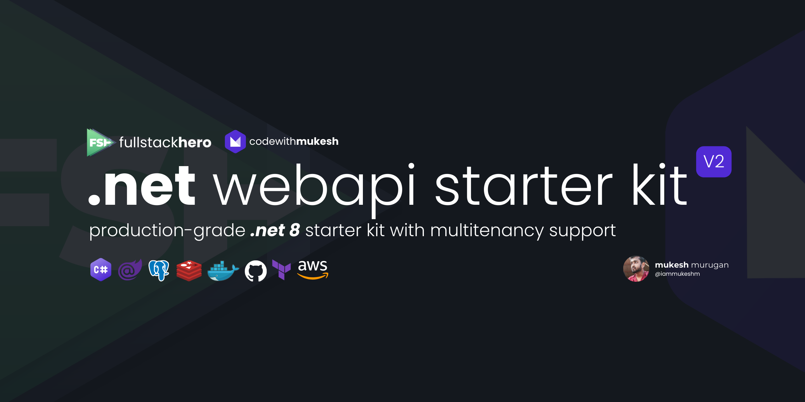

# FullStackHero .NET Web API Starter Kit

FullStackHero's .NET Web API Starter Kit is a starting point for your next `.NET 8 Clean Architecture` Solution that incorporates the most essential packages and features your projects will ever need including out-of-the-box Multi-Tenancy support. This project can save well over 200+ hours of development time for your team.

# 🎉 Getting Started

To install the template from NuGet.org run the following command:

```bash
tba
```

Then create a new solution:

```bash
tba
```

Finally, to update the template to the latest version run:

```bash
tba
```

# ✨ Features

- C# 12
- .NET 8
- ASP.NET Core
- Minimal APIs
- EF Core
- Swagger UI
- Clean Architecture Principles
- Vertical Slice Architecture
- Modular Monolith

# Endpoints

- [x] Tenants
  - [x] Create Tenant
  - [x] Get List of Tenants
- [x] Users
  - [x] Register
  - [x] Update Profile
  - [x] Get List of Users
- [x] Token
  - [x] Generate JWT
- [x] Products
  - [x] Create
  - [x] Get
  - [x] Get By ID
  - [x] Update
  - [x] Delete
- [x] Todo
  - [x] Create
  - [x] Get
  - [x] Get By ID
  - [x] Update
  - [x] Delete

# Add Migrations

Navigate to `./api/server` and run the following EF CLI commands.

```bash
dotnet ef migrations add "Add Identity Schema" --project .././migrations/postgresql/ --context IdentityDbContext -o Identity
dotnet ef migrations add "Add Tenant Schema" --project .././migrations/postgresql/ --context TenantDbContext -o Tenant
dotnet ef migrations add "Add Todo Schema" --project .././migrations/postgresql/ --context TodoDbContext -o Todo
dotnet ef migrations add "Add Catalog Schema" --project .././migrations/postgresql/ --context CatalogDbContext -o Catalog
```
