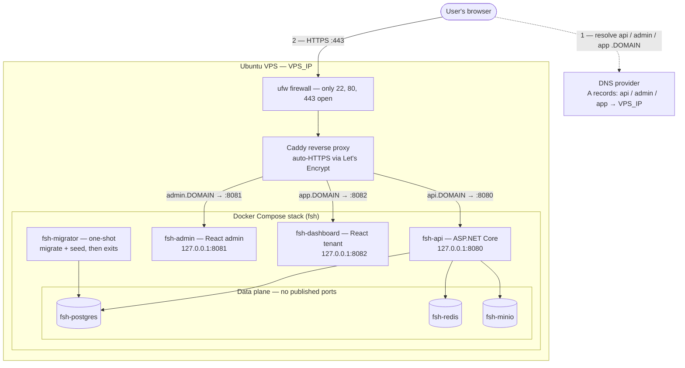
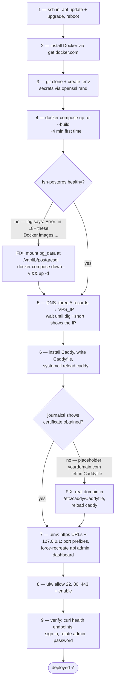
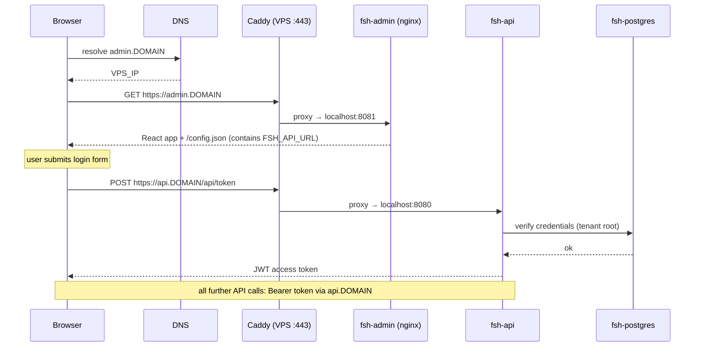

# Deploying to a fresh VPS — battle-tested runbook

A start-to-finish guide for deploying this project on a plain Ubuntu VPS (written on a
Hostinger KVM 2 — 2 vCPU / 8 GB RAM / 100 GB disk — Ubuntu 24.04, but any provider works).
It records every command that was actually run, every error hit along the way, and the fix
for each, so a redeploy on a new server is copy-paste.

**Placeholders used throughout — replace every occurrence:**

| Placeholder | Meaning | Example from the first deploy |
|---|---|---|
| `<VPS_IP>` | Your server's public IPv4 | `2.25.69.231` |
| `<DOMAIN>` | Your domain | `sabinstack.cloud` |

The three public surfaces end up at `api.<DOMAIN>`, `admin.<DOMAIN>`, `app.<DOMAIN>`.

---

## Architecture at a glance

What the finished deployment looks like. Only Caddy is reachable from the internet; the
three app containers are loopback-bound, and the data plane has no published ports at all.



## Deployment flow (with the errors we hit)

The happy path top to bottom, with the two failure branches from the first deploy and
where they re-join.



---

## 0. What you need

- A VPS: 2+ vCPU, 4+ GB RAM (8 GB comfortable), ~10 GB free disk. Root SSH access.
- A domain you control (any registrar). Required — the SPAs + API need three HTTPS
  subdomains; raw-IP HTTP breaks CORS/cookies and is test-only.
- ~45 minutes, most of it waiting for the first Docker build.

## 1. SSH in and update the OS

```bash
ssh root@<VPS_IP>
apt update && apt upgrade -y
reboot        # if the upgrade installed a new kernel — do it now, before anything runs
# wait ~30s, then ssh back in
```

## 2. Install Docker

```bash
curl -fsSL https://get.docker.com | sh
docker compose version    # expect v2.x
```

## 3. Clone the repo and create `.env`

```bash
git clone https://github.com/sabinshrestha/dotnet-starter-kit.git
cd ~/dotnet-starter-kit/deploy/docker
cp .env.example .env
```

Generate the secrets:

```bash
openssl rand -base64 48   # → JWT_SIGNING_KEY
openssl rand -hex 16      # run 4× → POSTGRES_PASSWORD, REDIS_PASSWORD,
                          #          MINIO_ROOT_PASSWORD, HANGFIRE_PASSWORD
```

Edit `nano .env` and fill in (final production values — see §7 for why the ports get the
`127.0.0.1:` prefix):

```ini
FSH_API_URL=https://api.<DOMAIN>
FSH_ADMIN_URL=https://admin.<DOMAIN>
FSH_DASHBOARD_URL=https://app.<DOMAIN>

FSH_API_PORT=127.0.0.1:8080
FSH_ADMIN_PORT=127.0.0.1:8081
FSH_DASHBOARD_PORT=127.0.0.1:8082

JWT_SIGNING_KEY=<base64 output>
SEED_ADMIN_PASSWORD=<your chosen admin login password>
HANGFIRE_USERNAME=hangfire
HANGFIRE_PASSWORD=<hex output>
POSTGRES_PASSWORD=<hex output>
REDIS_PASSWORD=<hex output>
MINIO_ROOT_USER=minioadmin
MINIO_ROOT_PASSWORD=<hex output>
```

> `.env` holds all secrets. Never commit it; keep a copy somewhere safe — losing
> `POSTGRES_PASSWORD` against an existing data volume is painful (see troubleshooting).

## 4. Build and launch the stack

```bash
cd ~/dotnet-starter-kit/deploy/docker
docker compose up -d --build
```

First build compiles the whole .NET solution + both React apps inside Docker:
**~4 minutes on 2 vCPUs** (measured). Later runs are cached and take seconds.

Watch the migrator apply migrations and seed the root tenant + admin user:

```bash
docker compose logs -f migrator     # wait for "[migrator] finished successfully."; Ctrl+C to exit
```

Expected (harmless) noise in that log:

- Two `ERR ... SELECT "MigrationId" ... "__EFMigrationsHistory"` lines — EF probing for
  its history table before creating it on a virgin database. First-run only.
- `Cannot load library libgssapi_krb5.so.2` — the Npgsql driver probing for Kerberos,
  which isn't in the slim image. Password auth is used; ignore.

Verify:

```bash
docker compose ps                             # 6 services Up; migrator + minio-init Exited (0)
curl -fsS http://localhost:8080/health/live   # {"status":"Healthy",...}
```

### ⚠ Error we hit here: `fsh-postgres` unhealthy / crashes ~1s after start

```
✘ Container fsh-postgres   Error dependency postgres failed to start
dependency failed to start: container fsh-postgres is unhealthy
```

`docker compose logs postgres` shows `Error: in 18+, these Docker images are configured
to store database data in ...`.

**Cause:** the `postgres:18` images moved PGDATA to `/var/lib/postgresql/<major>/docker`
and their entrypoint refuses to start when a volume is mounted at the legacy
`/var/lib/postgresql/data` path.

**Fix** (already applied to `docker-compose.yml` in this repo — only needed if you're on
an older checkout where the volume line still says `pg_data:/var/lib/postgresql/data`):

```bash
docker compose down -v      # DESTRUCTIVE — fine on first boot, never on a live DB
sed -i 's#pg_data:/var/lib/postgresql/data#pg_data:/var/lib/postgresql#' docker-compose.yml
docker compose up -d
```

## 5. Point DNS at the VPS

At your registrar/DNS panel, add three **A records**, all → `<VPS_IP>`:

| Type | Name | Points to |
|---|---|---|
| A | `api` | `<VPS_IP>` |
| A | `admin` | `<VPS_IP>` |
| A | `app` | `<VPS_IP>` |

Wait for propagation (usually minutes), and **do not continue until**:

```bash
dig +short api.<DOMAIN>     # each must print <VPS_IP>
dig +short admin.<DOMAIN>
dig +short app.<DOMAIN>
```

## 6. Install Caddy (reverse proxy + automatic HTTPS)

```bash
apt install -y debian-keyring debian-archive-keyring apt-transport-https curl
curl -1sLf 'https://dl.cloudsmith.io/public/caddy/stable/gpg.key' | gpg --dearmor -o /usr/share/keyrings/caddy-stable-archive-keyring.gpg
curl -1sLf 'https://dl.cloudsmith.io/public/caddy/stable/debian.deb.txt' | tee /etc/apt/sources.list.d/caddy-stable.list
apt update && apt install -y caddy
```

Replace `/etc/caddy/Caddyfile` entirely with (**use your real domain — see the error box
below**):

```
api.<DOMAIN> {
	reverse_proxy localhost:8080
}

admin.<DOMAIN> {
	reverse_proxy localhost:8081
}

app.<DOMAIN> {
	reverse_proxy localhost:8082
}
```

```bash
systemctl reload caddy
# ~30s later, confirm three "certificate obtained successfully" lines:
journalctl -u caddy --since "2 min ago" | grep -i certificate
```

WebSockets (SignalR chat/notifications) pass through `reverse_proxy` automatically.

### ⚠ Error we hit here: left the placeholder domain in the Caddyfile

```
"error":"HTTP 400 urn:ietf:params:acme:error:tls - ... remote error: tls: no application protocol"
"job failed","error":"admin.yourdomain.com: obtaining certificate: ..."
```

**Cause:** the Caddyfile was pasted with the literal placeholder `yourdomain.com` still in
it, so Let's Encrypt tried (and failed forever) to validate a domain we don't control.

**Fix:** edit `/etc/caddy/Caddyfile`, replace every hostname with the real domain,
`systemctl reload caddy`. Certificates were issued within seconds of the fix.

## 7. Apply the public URLs to the app

If you set the final values in §3 and haven't started with test URLs, just recreate the
three app containers so they re-read the environment (no rebuild needed — the URLs are
baked into `/config.json` at container **start**, and CORS is plain API env):

```bash
cd ~/dotnet-starter-kit/deploy/docker
docker compose up -d --force-recreate api admin dashboard
```

Why `127.0.0.1:` in front of the ports: **Docker's published ports bypass ufw** (Docker
writes its own iptables rules), so a firewall alone does NOT block 8080–8082 from the
internet. Binding them to loopback makes them unreachable from outside regardless of
firewall state; Caddy still reaches them via `localhost`.

## 8. Firewall

```bash
ufw allow 22/tcp      # FIRST — or you lock yourself out of SSH
ufw allow 80/tcp
ufw allow 443/tcp
ufw enable            # answer y
ufw status verbose
```

If your provider has a cloud firewall (e.g. Hostinger hPanel → VPS → Firewall rules),
either leave it disabled or allow the same three ports there — it filters *outside* the
VM, so it wins over anything configured inside.

## 9. Final verification

```bash
curl -fsS  https://api.<DOMAIN>/health/live     # {"status":"Healthy",...}
curl -fsSI https://admin.<DOMAIN> | head -1     # HTTP/2 200
curl -fsSI https://app.<DOMAIN>   | head -1     # HTTP/2 200
curl -m 5  http://<VPS_IP>:8081 ; echo blocked  # should time out (loopback binding works)
```

Sign in at `https://admin.<DOMAIN>`:

- **email** `admin@root.com` · **tenant** `root` · **password** = `SEED_ADMIN_PASSWORD`
- This is the only seeded account. **Rotate the password immediately**
  (Settings → Security), then create real users from the admin app.
- Hangfire dashboard: `https://api.<DOMAIN>/jobs` (login = `HANGFIRE_USERNAME`/`_PASSWORD`).
- API reference: `https://api.<DOMAIN>/scalar`.

## How a request flows once deployed

Useful mental model when debugging: the React apps run in the user's browser and call the
API **through Caddy at the public URL** (`FSH_API_URL`) — never container-to-container.
That's why the `.env` URLs must exactly match what the browser sees (CORS).



---

## Troubleshooting — every issue from the first deploy

| Symptom | Cause | Fix |
|---|---|---|
| `fsh-postgres` unhealthy, dies ~1s after start; log says `Error: in 18+, these Docker images...` | postgres 18 image rejects a volume mounted at legacy `/var/lib/postgresql/data` | Mount at `/var/lib/postgresql` (§4). Already fixed in this repo's compose file. |
| Caddy logs `tls: no application protocol` / cert `job failed` for `yourdomain.com` | Placeholder domain left in the Caddyfile | Put the real domain in `/etc/caddy/Caddyfile`, `systemctl reload caddy` (§6). |
| Site loads from some networks but `ERR_CONNECTION_TIMED_OUT` from others (e.g. an office network), while `curl` on the VPS returns 200 | Corporate/ISP web filter blocking a **newly-registered domain** (or the TLD). VPS-local curls succeed because they never leave the machine. | Nothing to fix server-side. Confirm via phone on mobile data or `check-host.net` TCP check on `<VPS_IP>:443`. Wait 24–72 h for domain categorization or ask IT to whitelist. Diagnose with `tcpdump -ni any 'tcp port 443'` — no packets during a browser reload ⇒ blocked upstream. |
| `ERR ... "__EFMigrationsHistory"` in migrator log | EF checks for its history table before creating it | First-run noise; ignore. |
| `Cannot load library libgssapi_krb5.so.2` | Npgsql probing Kerberos, absent in slim image | Ignore; password auth is used. |
| `xxx_PASSWORD is required` at `compose up` | Empty required var in `.env` | The error names the var; fill it. |
| `OptionsValidationException: SigningKey looks like a sample placeholder` | `JWT_SIGNING_KEY` contains `replace-with` | Generate a real key: `openssl rand -base64 48`. |
| Browser CORS error on the admin/dashboard app | An `FSH_*_URL` in `.env` doesn't exactly match the URL in the address bar (scheme/host, no trailing slash) | Fix `.env`, `docker compose up -d --force-recreate api admin dashboard`. |
| Migrator retries Postgres ~2 min then dies | Usually `POSTGRES_PASSWORD` changed against an existing `pg_data` volume | Restore the old password, or (data loss!) `docker compose down -v` and reseed. |
| Ports 8080–8082 reachable from the internet despite ufw | Docker's iptables rules bypass ufw | Loopback-bind the ports in `.env` (§7). |

## Day-2 operations

```bash
# Update to latest code (migrator re-runs idempotently before the API restarts)
cd ~/dotnet-starter-kit && git pull
cd deploy/docker && docker compose up -d --build

# Logs
docker compose logs -f api          # or admin / dashboard / postgres / redis / minio

# Restart everything (volumes/data untouched)
docker compose restart

# Backup the three stateful volumes (all persistent state lives here)
for v in fsh_pg_data fsh_redis_data fsh_minio_data; do
  docker run --rm -v $v:/source:ro -v "$PWD":/backup alpine \
    tar czf /backup/$v-$(date +%Y%m%d).tar.gz -C /source .
done
```

Recommended extras: your provider's snapshot/backup add-on, and disabling SSH password
auth once your key is installed (`PasswordAuthentication no` in `/etc/ssh/sshd_config`,
then `systemctl restart ssh`).
